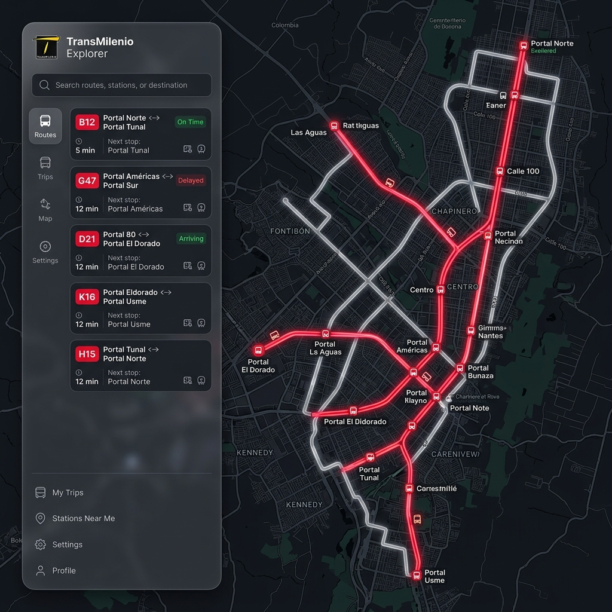

# TransMilenio Explorer 🚌



## Overview
**TransMilenio Explorer** is a high-performance, premium web application designed to visualize and explore the TransMilenio and SITP transit network in Bogotá, Colombia. It provides a real-time-like experience for checking routes, station layouts, and wagon distributions using an interactive map interface.

This project is built with a modern tech stack (Vite + Node.js) and features a robust proxy system to interface with transit data while maintaining high performance and data integrity.

---

## ⚡ Key Features

- **Interactive Transit Map**: Full visualization of Bogotá's transit arteries using high-fidelity map layers.
- **Route Tracking**: Real-time path highlighting for Troncal (Red) and Zonal (Blue) services.
- **Station & Wagon Intelligence**: Deep-dive into station layouts, identifying which services stop at specific wagons (vagones).
- **Advanced Search**: Instant filtering of routes by code (e.g., G47, B12, 661).
- **Catalog Synchronization**: A sophisticated backend scraper that caches and organizes official data into a searchable master catalog.
- **Premium UI**: Dark-mode primary interface with glassmorphism effects and smooth micro-animations.

---

## 🛠️ Architecture & Tech Stack

### Frontend (Client)
- **Framework**: [Vite](https://vitejs.dev/) + TypeScript
- **Styling**: Vanilla CSS (Premium custom design system)
- **Mapping Engine**: Mapbox GL JS / MapLibre (depending on configuration)
- **State Management**: Reactive UI with TypeScript services

### Backend (Server)
- **Runtime**: [Node.js](https://nodejs.org/) + Express + TypeScript
- **Data Layers**: Custom scraping services for `api.buscador-rutas.transmilenio.gov.co`.
- **Caching**: Local JSON-based master catalog with automatic stale-check and background sync.

### Live Tracking From Colombia

The official live-bus endpoint is **CO-IP geofenced** and serves **no CORS**, so a
normal web page cannot read it and a non-Colombian server is rejected by the
geofence.

#### Preferred: Live Bridge extension (uses *your* connection)

Install the [`extension/`](./extension) browser extension (one-time, **Load
unpacked**). Live tracking then runs **from your own browser**: the extension's
background fetch bypasses page CORS *and* carries your Colombian egress IP, so the
request never touches the server. See [`extension/README.md`](./extension/README.md).
When the extension is absent, the app automatically falls back to the server relay
below.

#### Cross-platform: browser-direct Colombia relay (PC + mobile, no install)

Run the relay on a **Colombian-egress** host and let the browser call it
directly. Works on every device with no per-user setup; the main server drops
out of the live path. Recommended free host: an **Oracle Cloud Always Free** VM
in the **Bogotá** region (datacenter uptime, $0 forever).

The relay must be served over **HTTPS** — the app is https and browsers block an
https page from calling an http relay (mixed content). **Tailscale Funnel** gives
a free, stable `https://<machine>.<tailnet>.ts.net` URL with no domain to buy.

**On the CO host (Oracle VM):**

```bash
# 1. Run the relay, allow-listing your web app's origin so it serves CORS.
RELAY_CLIENT_ORIGINS=https://transmilenio.onrender.com npm --prefix server run relay:co
# (defaults to port 8787)

# 2. Expose it over HTTPS with a stable free URL.
tailscale funnel 8787
# → https://<machine>.<tailnet>.ts.net
```

**On the client** (`client/.env`), point at that HTTPS URL:

```bash
VITE_LIVE_RELAY_URL=https://<machine>.<tailnet>.ts.net
```

The relay verifies its own egress country before every live request window and
returns HTTP `451` if egress is not `CO`. Requests to the official live API are
made by the Colombian relay/browser — never by Render, Google Apps Script, or
Cloudflare Workers (all non-CO).

> Have an always-on machine in Bogotá instead of a cloud VM? Run the exact same
> two commands on it — Oracle is only for guaranteed uptime.

#### Fallback: server-side relay

The main server can also forward to the relay (instead of the browser calling it
directly). Set on the main server:

```bash
TRANSMILENIO_COLOMBIA_RELAY_URL=https://<machine>.<tailnet>.ts.net
TRANSMILENIO_COLOMBIA_RELAY_SECRET=change-me
```

#### Zero-setup fallback: public Colombian proxies

No card, host, device, or install? Let the main server reach the live API through
free public Colombian proxies:

```bash
TRANSMILENIO_ALLOW_PUBLIC_CO_PROXY=1
```

The server scrapes several free proxy sources, **verifies each against the live
API** (only Colombian exits return data — the geofence is the filter), keeps a
warm scored pool, and **races the fastest few** proxies per request. A
**last-known-position cache** serves the most recent fix (tagged "datos de HH:MM")
whenever every proxy is momentarily down, so the map never blanks. Pool health is
visible at `GET /api/health` → `proxyPool`.

> **Honest limitation:** free proxies are best-effort — live tracking will be
> **intermittent**, not solid. There is no free way to make it reliable without a
> card (cloud), a Colombian device, or a per-user install. This is the floor of
> what's achievable with none of those.

Tunables: `LIVE_PROXY_TIMEOUT_MS` (default `14000`), `CO_PROXY_RACE_WIDTH`
(default `5`).

---

## 🚀 Getting Started

### Prerequisites
- [Node.js](https://nodejs.org/) (v18+)
- [npm](https://www.npmjs.com/)

### Installation

1. **Clone the repository:**
   ```bash
   git clone https://github.com/estebantorrg/transmilenio.git
   cd transmilenio
   ```

2. **Install dependencies:**
   ```bash
   npm install
   ```

3. **Configure environment:**
   - Create `.env` files in both `client/` and `server/` using the provided `.env.example` templates.

4. **Run in development:**
   ```bash
   npm run dev
   ```

---

## ⚖️ Legal Disclaimer & Data Notice

> [!IMPORTANT]
> **READ CAREFULLY:** This project is provided "as is" and is intended for **educational and informational purposes only**.

### 1. Ownership & Affiliation
This application is an **independent, non-official project** developed by **Esteban**. It is **not** affiliated, associated, authorized, endorsed by, or in any way officially connected with **TransMilenio S.A.**, the Mayor's Office of Bogotá, or any of their subsidiaries or affiliates.

### 2. Data Source & Trademarks
- **Data**: All transit data, including route names, station codes, and geographic coordinates, is fetched from publicly accessible endpoints of the official TransMilenio mobile application infrastructure.
- **Intellectual Property**: The name "TransMilenio", as well as all logos and related branding, are registered trademarks of TransMilenio S.A. No claim is made to the ownership of any transit data or official trademarks.
- **Scrubbing & Proxying**: This tool uses a proxy-based approach to fetch data. The developer is not responsible for any misuse of the data or for any actions taken by the data provider in response to the use of this software.

### 3. Liability
The developer assumes no responsibility for:
- Accuracy or availability of transit data.
- Disruptions in service.
- Any legal implications arising from the scraping or redistribution of the transit data.

Users are encouraged to use the [official TransMilenio website](https://www.transmilenio.gov.co) for official travel planning.

---

## 📄 License

This project's code is licensed under the **MIT License**. See the [LICENSE](LICENSE) file for the full text.

**Copyright (c) 2026 Esteban.** All Rights Reserved.

---

## 🤝 Credits
Developed with ❤️ for the city of Bogotá by **Esteban**.
